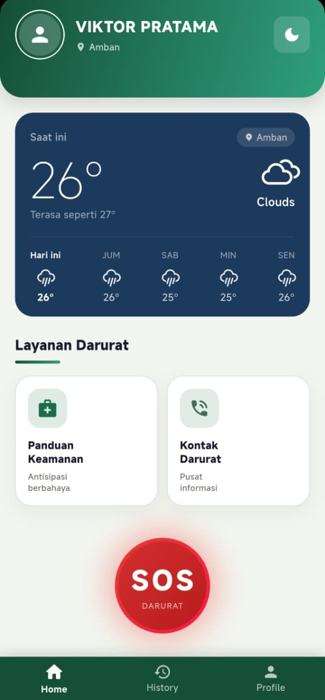
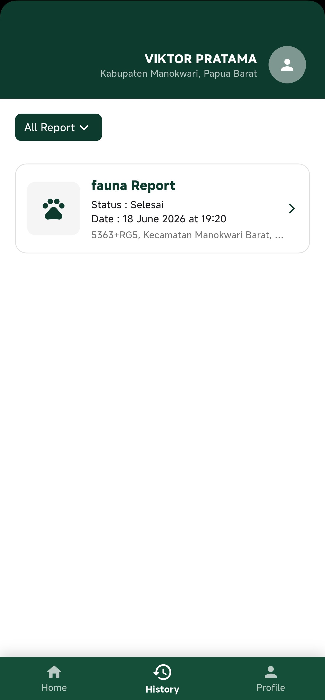
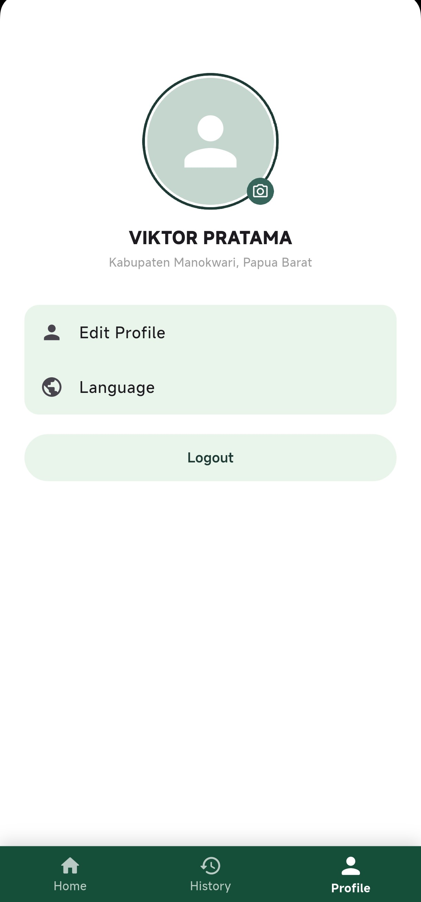

# Bhuwana Guard Mobile

Bhuwana Guard Mobile adalah aplikasi mobile berbasis Flutter yang dikembangkan untuk membantu proses pelaporan, pemantauan, dan pengelolaan informasi terkait flora dan fauna. Aplikasi ini menyediakan fitur autentikasi pengguna, laporan flora dan fauna, riwayat laporan, detail laporan, kontak darurat, serta pengelolaan profil pengguna.

Project ini dibuat sebagai bagian dari pengembangan aplikasi mobile dan portfolio, dengan fokus pada implementasi Flutter, Firebase, GitHub, UI/UX Design menggunakan Figma, serta deployment testing menggunakan Firebase App Distribution.

## Fitur Utama

* Login dan register pengguna
* Verifikasi akun pengguna
* Laporan flora dan fauna
* Riwayat laporan pengguna
* Detail laporan
* Emergency contact
* Pengelolaan profil pengguna
* Dukungan pengaturan bahasa
* Integrasi Firebase Authentication
* Integrasi Cloud Firestore
* Deployment testing menggunakan Firebase App Distribution

## Tech Stack

* Flutter
* Dart
* Firebase Authentication
* Cloud Firestore
* Firebase Storage
* Firebase App Distribution
* Git & GitHub
* Figma

## Preview Aplikasi

<table>
  <tr>
    <td align="center"><b>Login</b></td>
    <td align="center"><b>Home</b></td>
    <td align="center"><b>History</b></td>
    <td align="center"><b>Profile</b></td>
  </tr>
  <tr>
    <td align="center">
      
    </td>
    <td align="center">
      
    </td>
    <td align="center">
      
    </td>
    <td align="center">
      
    </td>
  </tr>
</table>

## UI/UX Design

Desain antarmuka aplikasi dibuat menggunakan Figma sebagai acuan dalam pengembangan tampilan aplikasi.

Figma Preview:
https://www.figma.com/design/nK69FCzoVV3Vfh3JVWI4Qn/Bhuwana-Guard?node-id=8-175&t=lz026M821MPqjuRF-1

## Download APK

APK testing dapat diunduh melalui halaman GitHub Releases.

Download APK:
[Bhuwana Guard Mobile v1.0.0](https://github.com/RidhoS22/Bhuwana_Guard_Mobile/releases/tag/v1.0.0)

Catatan: Aplikasi juga didistribusikan kepada tester menggunakan Firebase App Distribution.

## Cara Menjalankan Project

Clone repository:

```bash
git clone https://github.com/RidhoS22/Bhuwana_Guard_Mobile.git
```

Masuk ke folder project:

```bash
cd Bhuwana_Guard_Mobile
```

Install dependencies:

```bash
flutter pub get
```

Jalankan aplikasi:

```bash
flutter run
```

Build APK debug:

```bash
flutter build apk --debug
```

Build APK release:

```bash
flutter build apk --release
```

File APK release akan tersedia di:

```text
build/app/outputs/flutter-apk/app-release.apk
```

## Struktur Folder

```text
lib/
├── features/
│   ├── auth/
│   ├── emergency_contact/
│   ├── history/
│   ├── home/
│   └── splash/
├── services/
├── firebase_options.dart
└── main.dart

docs/
└── screenshots/
    ├── LoginForm.jpeg
    ├── HomePage.jpeg
    ├── HistoryPage.jpeg
    └── ProfilePage.jpeg
```

## Deployment

Aplikasi ini menggunakan Firebase App Distribution untuk proses testing. APK hasil build Flutter diunggah ke Firebase, kemudian tester ditambahkan melalui email agar dapat mengunduh dan menguji aplikasi langsung di perangkat Android.

Alur deployment:

```text
Flutter Build APK
↓
Upload APK ke Firebase App Distribution
↓
Tambahkan tester melalui email
↓
Isi release notes
↓
Distribute
↓
Tester mengunduh dan menguji aplikasi
```

## Status Project

Project ini masih berada dalam tahap pengembangan dan testing. Beberapa fitur dapat terus diperbarui sesuai kebutuhan pengembangan, pengujian, dan penyempurnaan aplikasi.

## Developer

Dikembangkan oleh:

* Ridho Syahfero
* Rajab Agustami Efendi
* Hengky Indrawan
